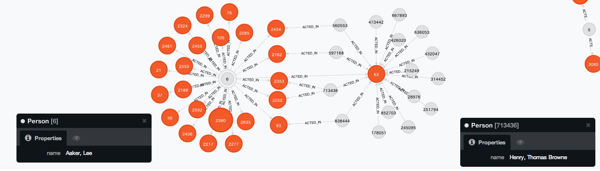
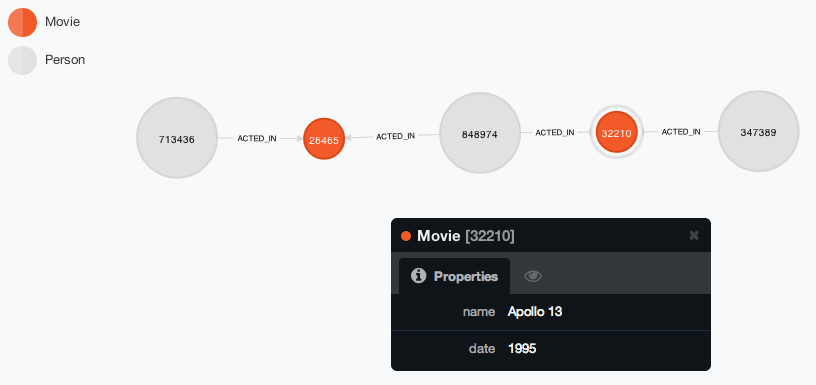

#Software Systems Homework 3 Report

###Noam Rubin and Cory Dolphin

######code: github.com/nrubin/SoftSysHW3

For this homework we chose to use a graph database called [neo4j](http://www.neo4j.org) which specializes in graph traversal problems like the Bacon problem. We insert parsed IMDb data through the neo4j REST API and access the database by making requests to the REST API through C, then parsing the JSON results. View [README.md](https://github.com/nrubin/SoftSysHW3/blob/master/README.md) for installation instructions.

#####1. Installation: Is it free?  What license is it under?  Is it easy to install?

  Neo4j actually comes in two different versions, under two very distinct licenses, in both the Neo4j Community and Neo4j Enterprise versions. The free community version is licensed under the permissive and viral GPL. The subscription based, enterprise version is offered on a subscription basis, and licensed under AGPL.

#####2. Immersion: How hard is it to get started?  Is there good documentation?  Example code?

  It's very easy to get started. Not only is the neo4j documentation thorough, but the tutorial available through the local server is the Bacon path problem. The is a lot of example code for both the Cypher query system and the many APIs that act as access points. In addition, the examples for the REST API are easy to follow and thorough.

#####3. Semantics: What kind of queries can the system handle efficiently? Is there a good match between these capabilities and the algorithms we want to run?

  The system can handle anything from simple lookups by node property to advanced graph traversal. The prime attraction of this database is that several shortest path algorithms are implemented at the query level, including Dijkstra's algorithm.

#####4. Performance: How fast can we process basic queries?  Will the performance scale up to large numbers of concurrent queries?  Can we index the data or precompute partial results to speed things up?

  We can process basic queries in ~100ms depending upon the size of the database and the performance of the machine in question. In order to speed up queries, nodes and relationships are automatically cached in memory, allowing fast traversal of common subpaths. These nodes are expired in a least recently used (LRU) fashion, and stored both in a durable file which is memory mapped, and an in-memory store.

  With this database implementation, it is difficult to explicitly recompute partial results, beyond the internal caching in Neo4j. 


#####5. ACIDity: What guarantees can the DBMS make regarding data consistency, integrity, and related issues?
Neo4j is fully ACID compliant, using a transactional model.

  

#####6. C interface: If we implement the server code in C, we'll need a C API to the DBMS.  How does this API look?  Is it easy to get started?  Does it seem to be mature and reliable?


  Though there does not exist a C driver API to neo4j, the neo4j REST API is well-developed and fairly easy to interface with. For REST operations, the `query.c` sample script uses the C standard `curllib`, and for parsing the JSON responses it uses `jansson`. As REST and JSON are both reliable and well-documented standards, implementing interaction with these standards in C is simple. There's a lot of sample code out there to this this exact thing, which helps.

  However, such an implementation is not as efficient as opening a persistent connection to a server and sending requests and receiving responses over a binary protocol, such as thrift. In this case, there is the overhead of HTTP and JSON serialization to deal with.


### Important Code Examples
  There are a number of interesting and important code samples which help to describe the implementation, and advantages of using Neo4j for this project.

  Neo4j's domain specific knowledge about graphs allows simple builtin visualization of the data structures. As seen below, the webserver includes D3.js to display the graph, and simply querying for the first 25 relationships:

```cypher
MATCH (a)-[:`ACTED_IN`]->(b) RETURN a,b LIMIT 25
```

  Produces a powerful graph:
  

  Alternatively, because Neo4j is heavily JVM based, there are no C API drivers,
  requiring the use of curllib or a similar HTTP library to connect to the database.
  As such, the process of querying for the shortest path requires an HTTP request using Neo4j's query language, Cypher:

```Cypher
MATCH (bestmeatever:Person { name:"Bacon, Kevin (I)" }),(anobody:Person { name:"Henry, Thomas Browne" }),
  p = shortestPath((bestmeatever)-[*..15]-(anobody))
RETURN p

```


In C, using curllib, we created the following implementation:

```C
int get_shortest_path(char *origin_node_url, char *dest_node_url)
{
    post_write_buffer s;
    json_error_t error;
    json_t *root, *path_length;
    int ret;
    char *post_data = (char *) malloc(sizeof(char) * 500);
    char *url = (char *) malloc(sizeof(char) * 200);

    sprintf(post_data, "{ \"to\" : \"%s\", \"max_depth\" : 10, \"algorithm\" : \"shortestPath\" }", dest_node_url);
    sprintf(url, "%s/path", origin_node_url);

    char *text = post(url, post_data, &s);

    root = json_loads(text, 0, &error);

    path_length = json_object_get(root, "length");
    ret = (int) json_integer_value(path_length);

    free(post_data); //same as free(s->ptr)
    free(url);
    free(text);
    json_decref(root);

    return ret;

}
```


  While there is clearly an overhead to using the restful interface to access the
  database, querying for the shortest path is a simple and compact command.


